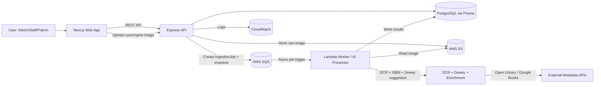

# ShelfSight Technical Specification – Task 1

---

# 1) Scope Boundaries

## 1.1 In Scope (MVP/Core Scope)

Must-have features explicitly listed in the proposal:

### Authentication + Roles
- JWT-based authentication
- Role-based access: Admin, Staff, Patron

### Catalog Management
- Books, copies, metadata
- Search/filter by title, author, subject, Dewey category

### AI-Assisted Book Ingestion via Image Upload
- OCR text extraction
- ISBN detection + metadata enrichment
- Dewey Decimal suggestion with confidence score
- Manual review/override required before saving

### Circulation
- Check-in / check-out
- Due dates + overdue tracking
- Basic fine calculation

### 2D Map + Shelf Browsing
- Custom-built 2D map with labeled shelf sections
- Clickable shelf zones
- Zoom-in first-person shelf view
- Zoom-out to full map

### AI Organizational Recommendations (Advisory)
- Based on Dewey classification, shelf capacity, existing placement
- Recommendations are reviewable; librarians remain final decision makers

---

## 1.2 Out of Scope (MVP)

Nice-to-have/stretch goals:

- Drag-and-drop shelf reorganization
- Duplicate / missing-volume detection
- Analytics dashboard
- Barcode/QR generation
- Multilingual UI/metadata
- User-defined tags/collections
- “Canvas editor” for map design

---

# 2) Success Metrics & Non-Functional Requirements (NFRs)

## 2.1 Performance & Capacity Targets
- Load core pages (catalog search, map view) in < 3 seconds
- Support ≥ 500 books and 100 concurrent users
- Librarian can locate a book via the map in under 10 seconds

## 2.2 AI Quality Targets
- ≥ 90% ISBN detection accuracy when visible
- ≥ 80% Dewey suggestion acceptance rate after review

## 2.3 Security & Privacy
- JWT authentication
- Role-based access control
- Secure file uploads
- Basic audit logging

---

# 3) Clear Separation of Concerns

## 3.1 Frontend (Next.js)

Responsibilities:
- Admin dashboard
- Catalog management UI
- Shelf map visualization
- Circulation interface
- Calls REST API (TanStack Query)
- Uploads images via backend endpoint
- Displays ingestion review screen

Frontend must NOT:
- Perform OCR/classification in browser
- Store secrets or API keys

---

## 3.2 Backend (Express + Prisma + Postgres)

Responsibilities:
- JWT issuance + RBAC enforcement
- CRUD for books, copies, loans, shelf sections
- Orchestrate ingestion jobs
- Integrate metadata sources (Open Library / Google Books)
- Provide map section data and shelf contents

Backend must NOT:
- Perform heavy OCR inside request thread (use queue/Lambda worker)

---

## 3.3 AI/Data Layer

Responsibilities:
- OCR extraction
- ISBN detection
- Metadata enrichment
- Dewey suggestion + confidence scoring
- Return structured output to backend

AI/Data Layer must NOT:
- Write directly to DB
- Auto-apply catalog updates

Manual review is mandatory.

# 4) System Architecture Diagram

# 5) Data Model (Minimal, AI-Friendly Schema)
- 5.1 Core Entities

  - User
    - id (uuid)
    - email (unique)
    - passwordHash
    - role: ADMIN | STAFF | PATRON
    - createdAt
    - updatedAt

  - Book
    - id (uuid)
    - title
    - authors (string or string[])
    - subjects (string or string[])
    - isbn10 (nullable)
    - isbn13 (nullable)
    - dewey (nullable)
    - publisher (nullable)
    - publishYear (nullable)
    - coverImageUrl (nullable)
    - createdAt
    - updatedAt

  - Copy
    - id (uuid)
    - bookId (fk)
    - status: AVAILABLE | CHECKED_OUT
    - createdAt
    - updatedAt

  - Loan
    - id (uuid)
    - copyId (fk)
    - userId (fk)
    - checkedOutAt
    - dueAt
    - returnedAt (nullable)
    - fineCents (default 0)
    - createdAt
    - updatedAt

  - ShelfSection
    - id (uuid)
    - label
    - mapX
    - mapY
    - width
    - height
    - capacity (nullable)
    - createdAt
    - updatedAt

  - Placement
    - id (uuid)
    - copyId (fk)
    - shelfSectionId (fk)
    - positionIndex (nullable)
    - createdAt
    - updatedAt

- 5.2 Ingestion Entities

  - IngestionJob
    - id (uuid)
    - createdByUserId (fk)
    - status: PENDING | PROCESSING | NEEDS_REVIEW | APPROVED | REJECTED | FAILED
    - imageUrl (stored in S3)
    - ocrText (nullable)
    - detectedIsbn (nullable)
    - suggestedDewey (nullable)
    - deweyConfidence (0..1)
    - suggestedMetadata (JSON)
    - reviewedByUserId (nullable)
    - reviewEdits (JSON)
    - createdAt
    - updatedAt

  - Recommendation
    - id (uuid)
    - type: MISPLACED | CAPACITY | GROUPING
    - shelfSectionId (nullable)
    - bookId / copyId (nullable)
    - message
    - confidence (0..1)
    - status: OPEN | DISMISSED | ACCEPTED
    - createdAt
    - updatedAt

  - Design Note
    - Ingestion + Recommendations are decoupled from Book/Catalog
    - Manual review is mandatory before catalog insertion

# 6) API Contract

- Conventions
  - JSON everywhere
  - Standard error format:
    - {
        "error": {
          "code": "STRING_CODE",
          "message": "Human readable message"
        }
      }
  - Pagination:
    - GET /books?query=&limit=&cursor=

- 6.1 Auth
  - POST /auth/login
    - Request:
      - email
      - password
    - Response:
      - token
      - role
  - GET /users/me
    - Response:
      - user
      - activeLoans
      - fines

- 6.2 Book Catalog
  - GET /books
    - Query parameters:
      - title
      - author
      - genre/subject
      - ISBN
      - dewey
  - POST /books (Staff/Admin only)
    - Request body:
      - title
      - authors
      - subjects
      - isbn10 (optional)
      - isbn13 (optional)
      - dewey (optional)

- 6.3 AI Ingestion
  - POST /ingest/analyze
    - Accepts:
      - image upload (spine/cover)
    - Returns:
      - ocrText
      - isbn
      - suggestedDeweyClass
      - confidence
      - suggestedMetadata

  - Supporting endpoints (async flow)
    - GET /ingest/jobs/:id
    - POST /ingest/jobs/:id/approve
    - POST /ingest/jobs/:id/reject

  - Rule:
    - Manual review remains mandatory

- 6.4 Circulation
  - POST /loans/checkout
    - Creates loan
    - Sets copy status → CHECKED_OUT
  - POST /loans/checkin
    - Calculates overdue fine
    - Sets copy status → AVAILABLE

- 6.5 Library Map
  - GET /map/sections
    - Returns:
      - All shelf zones
      - Coordinates
      - Labels
  - GET /map/shelves/:id
    - Returns:
      - Shelf contents
      - Books list

# 7) AI Ingestion Pipeline

- 7.1 Synchronous MVP Option
  - Backend receives image
  - Runs OCR + enrichment inline
  - Returns results immediately
  - Risk:
    - Request timeouts under load

- 7.2 Recommended Async Design (S3 + SQS + Lambda)

  - Flow:
    - POST /ingest/analyze
      - Save image to S3
      - Create IngestionJob (PENDING)
      - Enqueue jobId to SQS
      - Return { jobId, status }

    - Lambda worker:
      - Download image from S3
      - OCR extraction
      - ISBN detection
      - Metadata enrichment (Open Library / Google Books)
      - Dewey suggestion
      - Update job → NEEDS_REVIEW

    - Frontend:
      - Poll GET /ingest/jobs/:id
      - Display results

    - Staff:
      - Review edits
      - Approve

    - Backend:
      - Create Book + Copy + Placement

  - Guarantee:
    - No book enters catalog without manual review

# 8) AI Organization Recommendations (MVP)

- Inputs
  - Book Dewey numbers
  - ShelfSection capacity
  - Placement mapping

- Outputs
  - Recommendation objects
    - type
    - message
    - confidence

- Rules
  - MISPLACED
  - CAPACITY
  - GROUPING

- Constraint
  - Advisory only
  - No automatic reorganization

# 9) Implementation Conventions (AI-Friendly)

- 9.1 Backend Structure
  - /src
    - /routes
    - /controllers
    - /services
    - /repositories
    - /middleware
    - /validators
    - /types
    - /jobs

- 9.2 Naming Rules
  - Explicit DTOs per endpoint
  - Enums used exactly as defined
  - UUID strings for all IDs

- 9.3 RBAC Rules
  - POST /books → Staff/Admin only
  - Loans endpoints → Staff/Admin only
  - Map endpoints → Any authenticated user
